# Reproducibility Assessment of RNA-seq Quantification Pipelines

An end-to-end bioinformatics and statistical framework evaluating the impact of quantification strategies on differential gene expression profiling. 

This repository evaluates how the choice of software pipelines influences biological conclusions when analyzing the same raw genetic data. It utilizes public data from a genetically engineered mouse model focusing on prostate cancer initiation driven by the Trp53 R270H mutation.

## Project Importance

When scientists study diseases like cancer using RNA sequencing, they rely on computational pipelines to convert raw biological data into a list of genes turned up or down by a disease. 

However, different algorithms use vastly different mathematical and biological assumptions. If a gene is flagged as highly critical by one software package but completely ignored by another, downstream medical conclusions or therapeutic targets could be compromised. This project serves as a transparency benchmark to separate genuine biological signals from software-specific artifacts.

## What Was Done

The analysis was performed on a dataset consisting of three genotype groups: Wild-Type, Heterozygous, and Homozygous. The core benchmark focused on the Homozygous vs Wild-Type comparison across two major computational steps:

### 1. Gene Quantification
Compared two fundamentally different mapping strategies:
* Alignment-based: HISAT2 and StringTie, which maps raw data precisely onto a physical reference genome.
* Pseudoalignment-based: Kallisto and tximport, an alignment-free approach that breaks data into tiny fragments to drastically speed up calculations.

### 2. Differential Expression Frameworks
Tested three industry-standard tools on the exact same quantified data to observe differences in statistical mathematics:
* DESeq2: Negative Binomial modeling with shrinkage estimation.
* edgeR: Negative Binomial modeling with empirical Bayes estimation.
* limma-voom: Linear modeling designed initially for microarrays, adapted with weight transformations.

### 3. Biological and Isoform Validation
* Pathway Analysis: Used clusterProfiler to check if varying gene lists pointed to the same functional biological processes.
* Transcript-Level Resolution: Explored individual gene alternate splicing via DESeq2 to capture hidden signals masked at the general gene level.

## Summary of Results

### Pipeline Quantification Agreement
* High Global Correlation: Changing the underlying mapping strategy still preserved a strong global correlation of r = 0.767 across all 17,159 analyzed genes.
* Overlapping Targets: The two quantification approaches shared a 58.2 percent overlap (428 genes) of core significant altered genes.


<p align="center">
  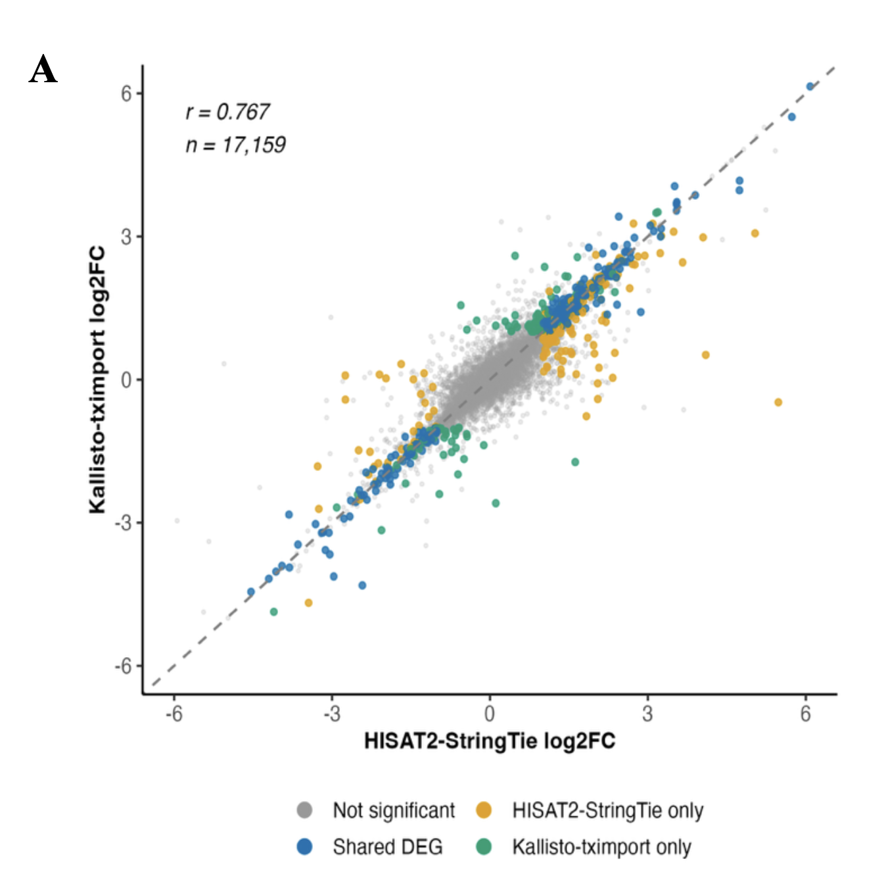
</p>

*Figure 1. Log2 fold-change correlation between HISAT2-StringTie and Kallisto-tximport quantification (r = 0.767, n = 17,159 genes), showing strong agreement between alignment-based and pseudoalignment-based approaches.*

<p align="center">
  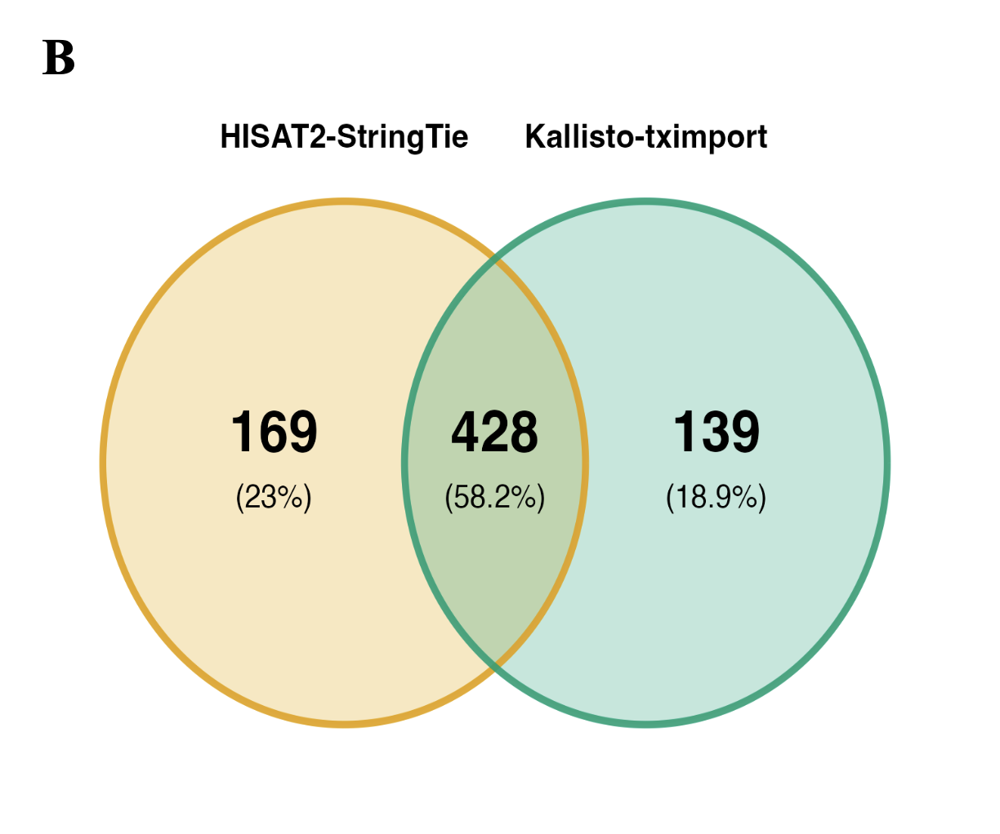
</p>

*Figure 2. Overlap of significantly differentially expressed genes called by each quantification pipeline (58.2% shared, 428 genes).*

<p align="center">
  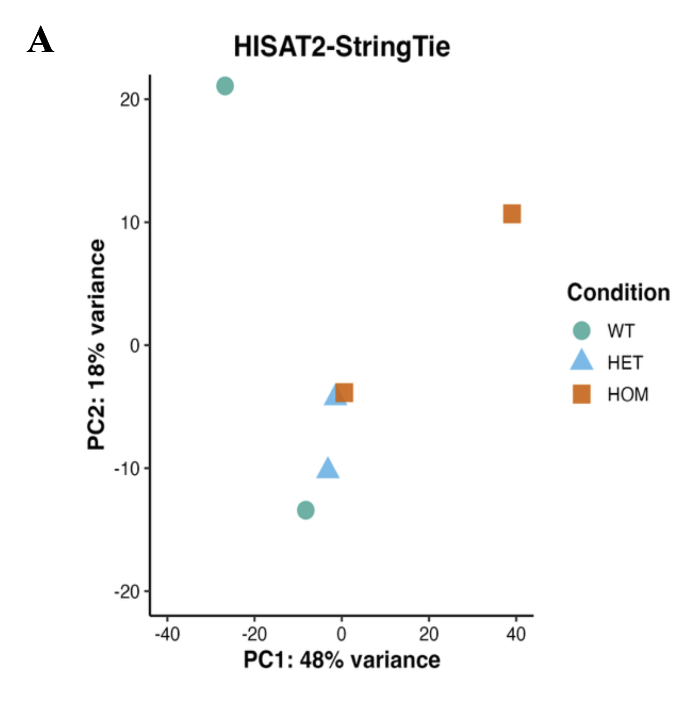 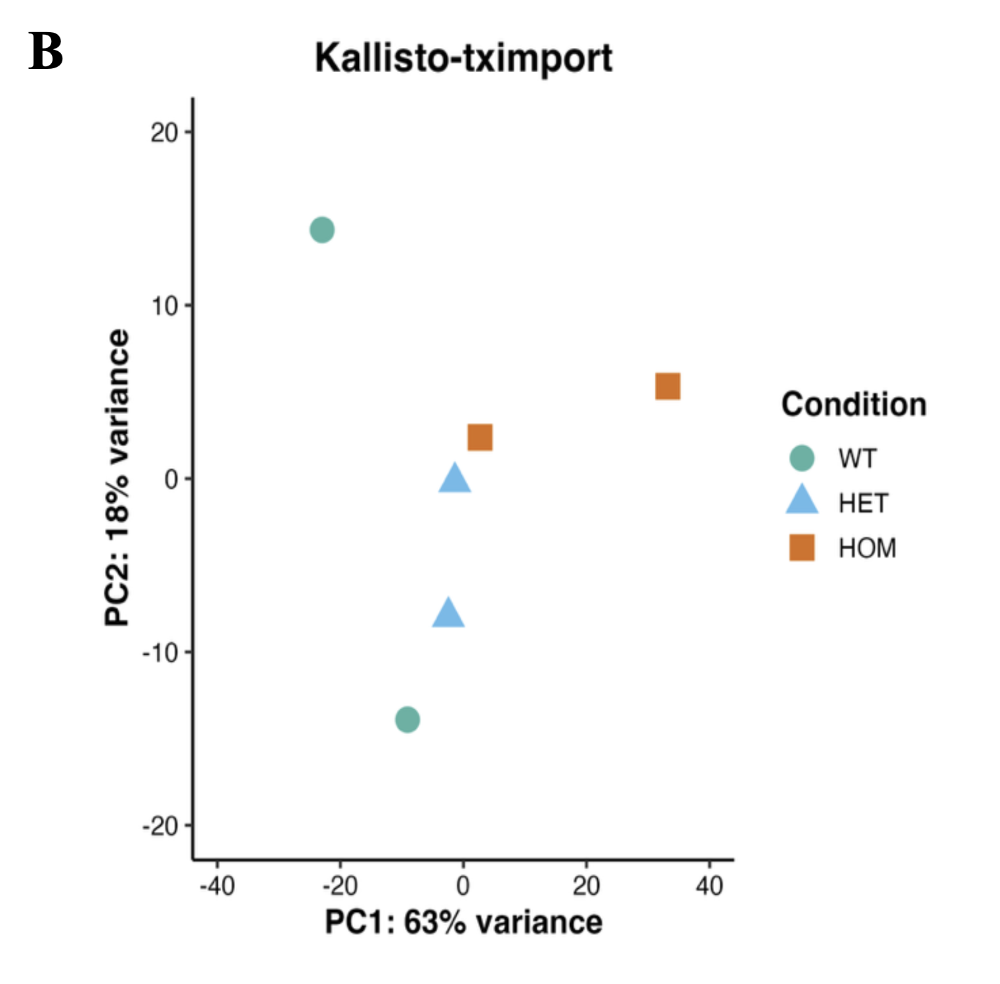
</p>

*Figure 3. PCA of samples by genotype (WT, HET, HOM) under HISAT2-StringTie (left) and Kallisto (right) quantification.*

### Statistical Software Divergence
The choice of statistical tool drastically scaled the volume of discoveries under identical cutoff criteria:
* DESeq2 identified 734 genes (525 up, 209 down).
* edgeR identified 632 genes (421 up, 211 down).
* limma-voom was highly conservative, identifying only 8 genes (7 up, 1 down). 
* Concordance: All 8 genes flagged by limma-voom were successfully captured by both DESeq2 and edgeR, proving they represent the absolute highest-confidence biological signals.


<p align="center">
  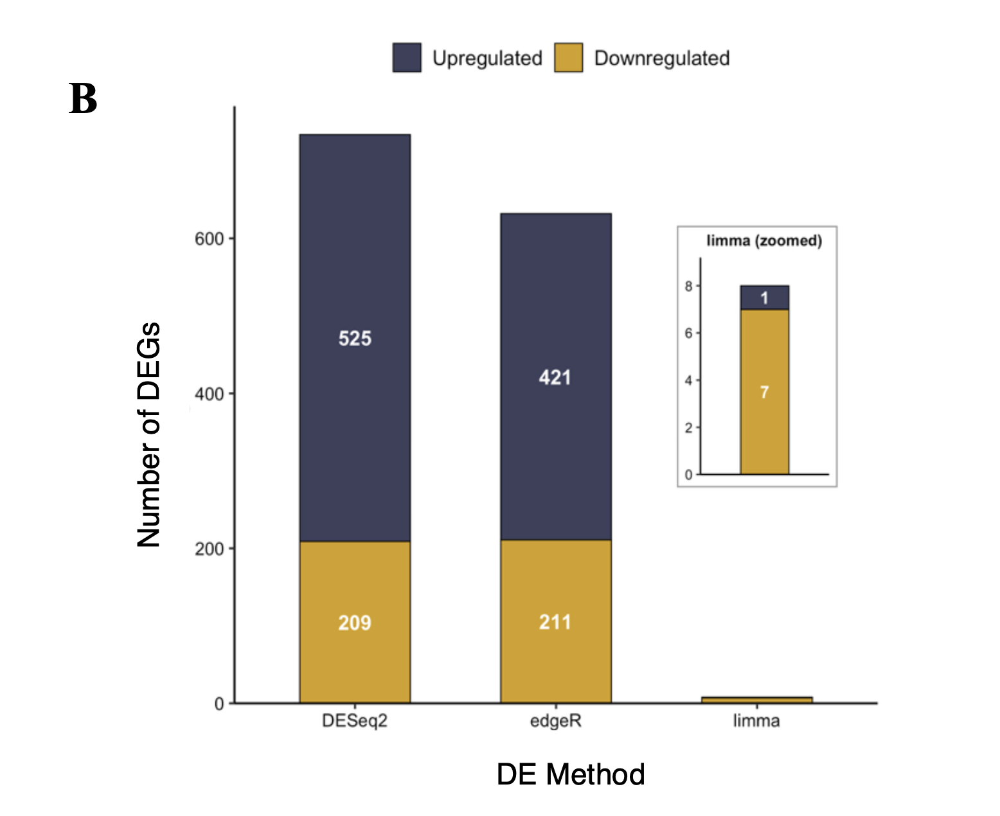
</p>

*Figure 4. Number of up- and down-regulated genes called by DESeq2, edgeR, and limma-voom under identical cutoff criteria.*

<p align="center">
  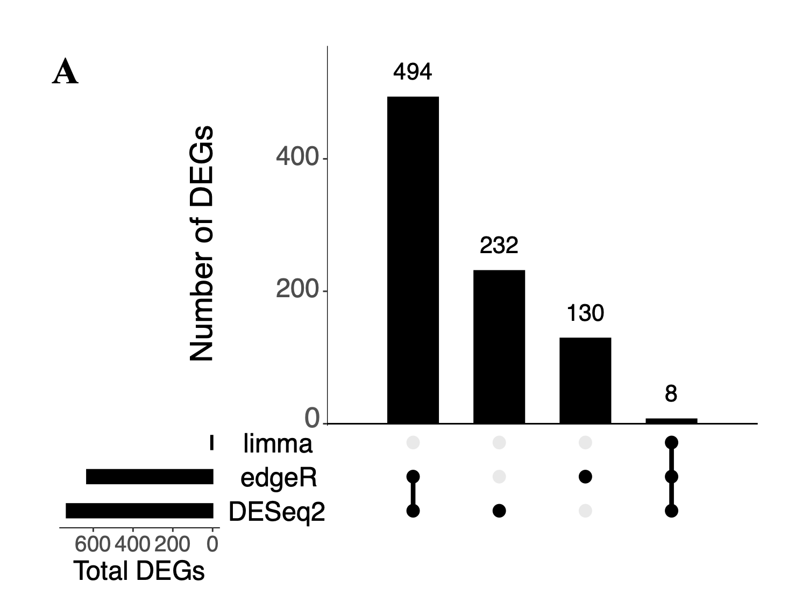
</p>

*Figure 5. UpSet plot showing intersection of significant DEGs across the three DE tools, illustrating that all limma-voom hits are a subset of DESeq2 and edgeR calls.*

<p align="center">
  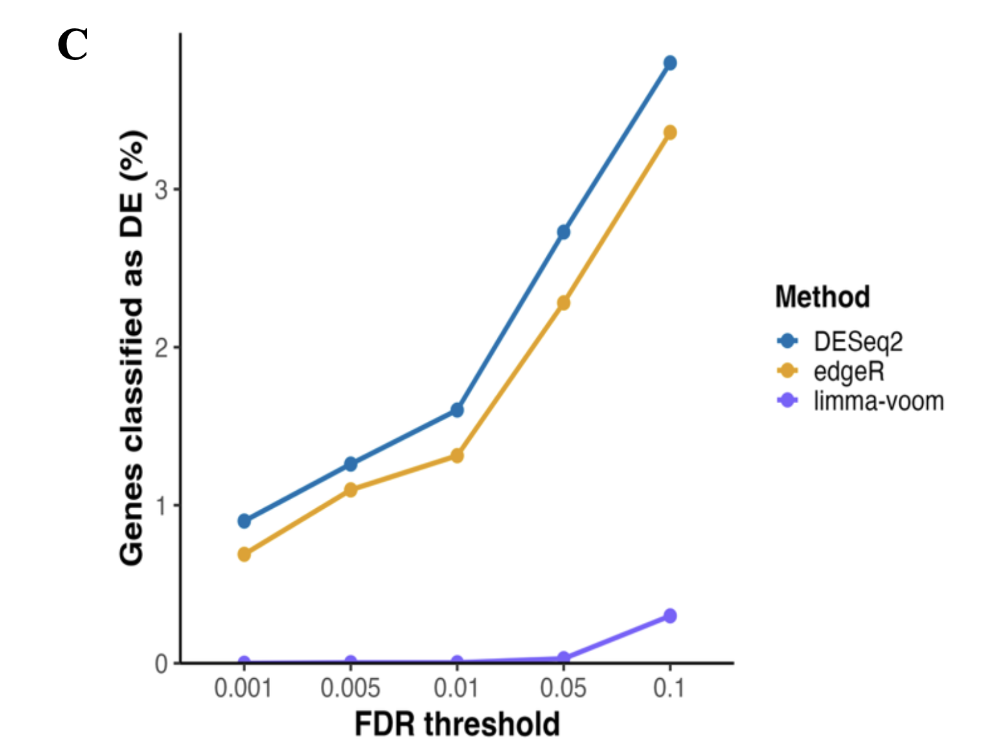
</p>

*Figure 6. Sensitivity of DEG counts to FDR threshold across tools.*

### Biological Interpretations Shift
* Microenvironment Alterations: DESeq2 and edgeR primarily highlighted structural changes in the tumor microenvironment, dominating their profiles with muscle system and tissue processes.
* Direct Mutation Signals: Because limma-voom only captured a tiny pool of highly significant genes, it bypassed the structural muscle background and directly pinpointed p53-class mediation and cellular apoptosis pathways.
* Isoform Insights: High-resolution transcript exploration successfully unmasked isoform switching behaviors in cancer-associated genes like Hnrnpa1 that were completely hidden during traditional gene-level evaluations.


<p align="center">
  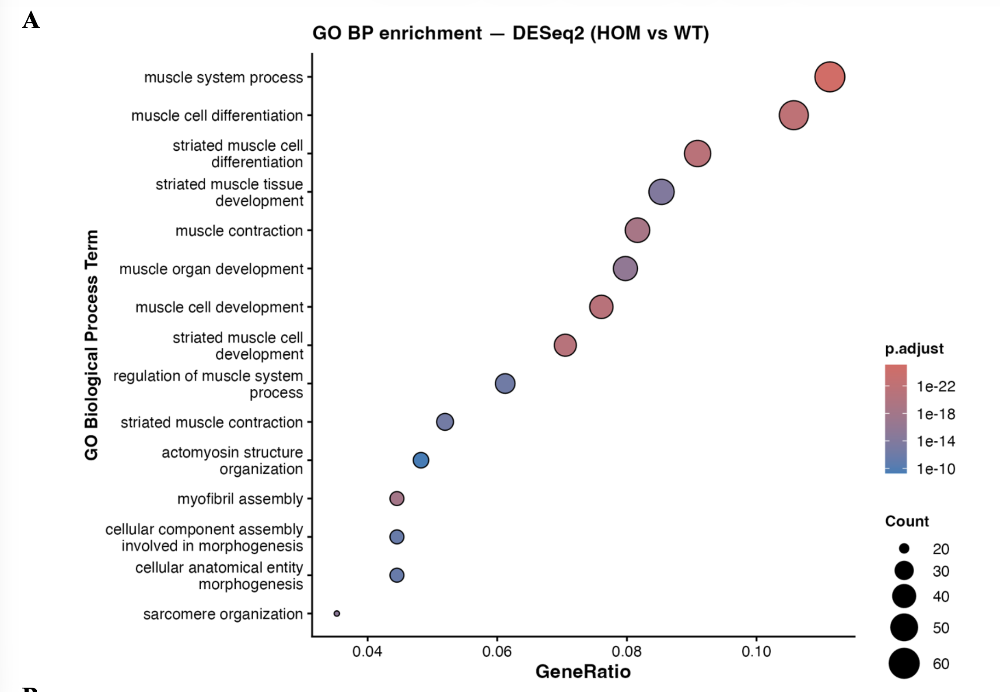 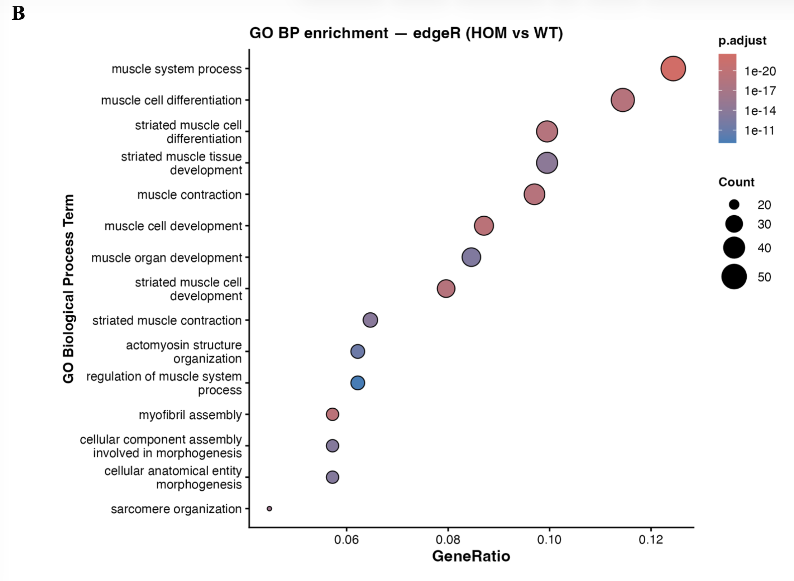
</p>

*Figure 7. Top enriched GO Biological Process terms from DESeq2 (left) and edgeR (right) DEG lists, dominated by muscle system and tissue remodeling processes.*

<p align="center">
  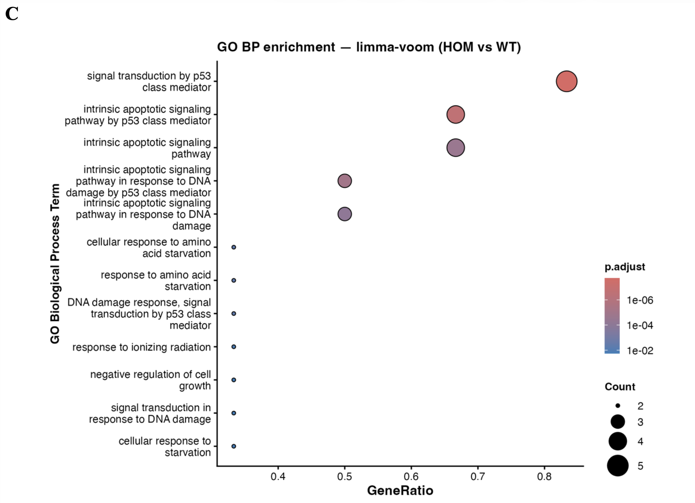
</p>

*Figure 8. GO enrichment from the limma-voom high-confidence gene set, highlighting p53-mediated and apoptotic pathways rather than structural/muscle terms.*

<p align="center">
  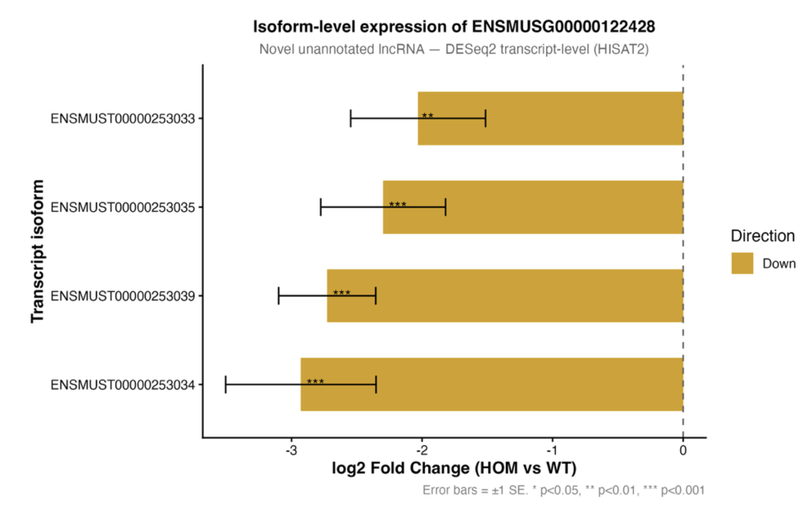
</p>

*Figure 9. Transcript-level isoform switching in Hnrnpa1, undetectable at the gene-level summary but resolved via transcript-level DESeq2 analysis.*

## Repository Structure

```text
rna-seq-hpc-pipeline/
├── data/
│   └── Metadata.txt
├── scripts/
│   ├── 01_pipeline_quantification.sh
│   ├── 02_kallisto_quant.sh
│   ├── 03_hisat2_deseq2.R
│   ├── 04_hisat2_edger.R
│   ├── 05_hisat2_limma_voom.R
│   ├── 06_kallisto_deseq2.R
│   ├── 07_kallisto_sleuth.R
│   ├── 08_pca_generation.R                 
│   ├── 09_pipeline_benchmarking_plots.R    
│   ├── 10_de_method_benchmarking.R         
│   ├── 11_go_enrichment_dotplots.R         
│   └── 12_isoform_expression_plots.R       
└── README.md
```

## Infrastructure and Dependencies
* High-Performance Computing: Deployed and run via an Imperial College Cluster HPC environment.
* Upstream Linux Shell Tools: hisat2/2.2.1, samtools/1.6, kallisto/0.51.1, python/2.7.11.
* Downstream R Statistical Packages: R/4.5.2, DESeq2, edgeR, limma, tximport, sleuth, clusterProfiler, UpSetR, ggplot2.


